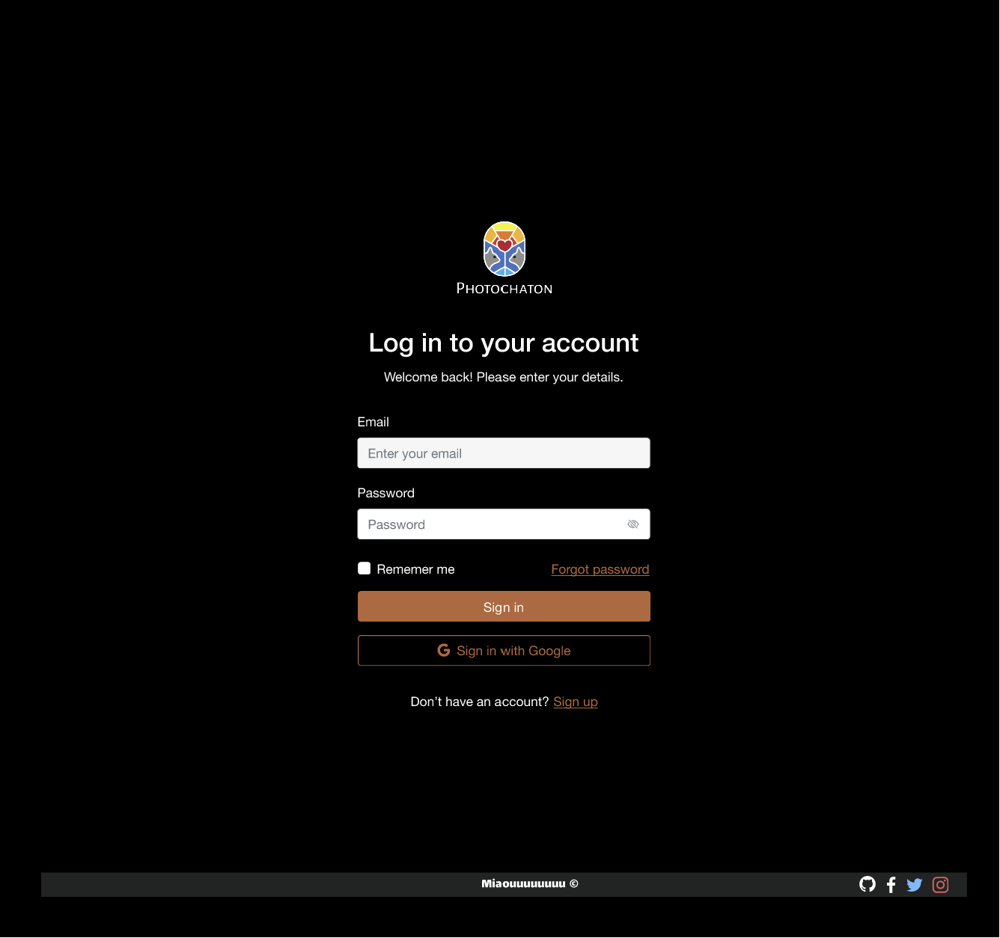
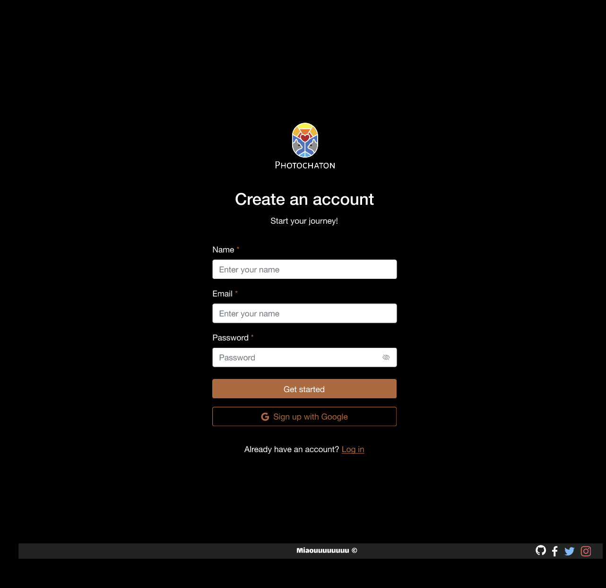
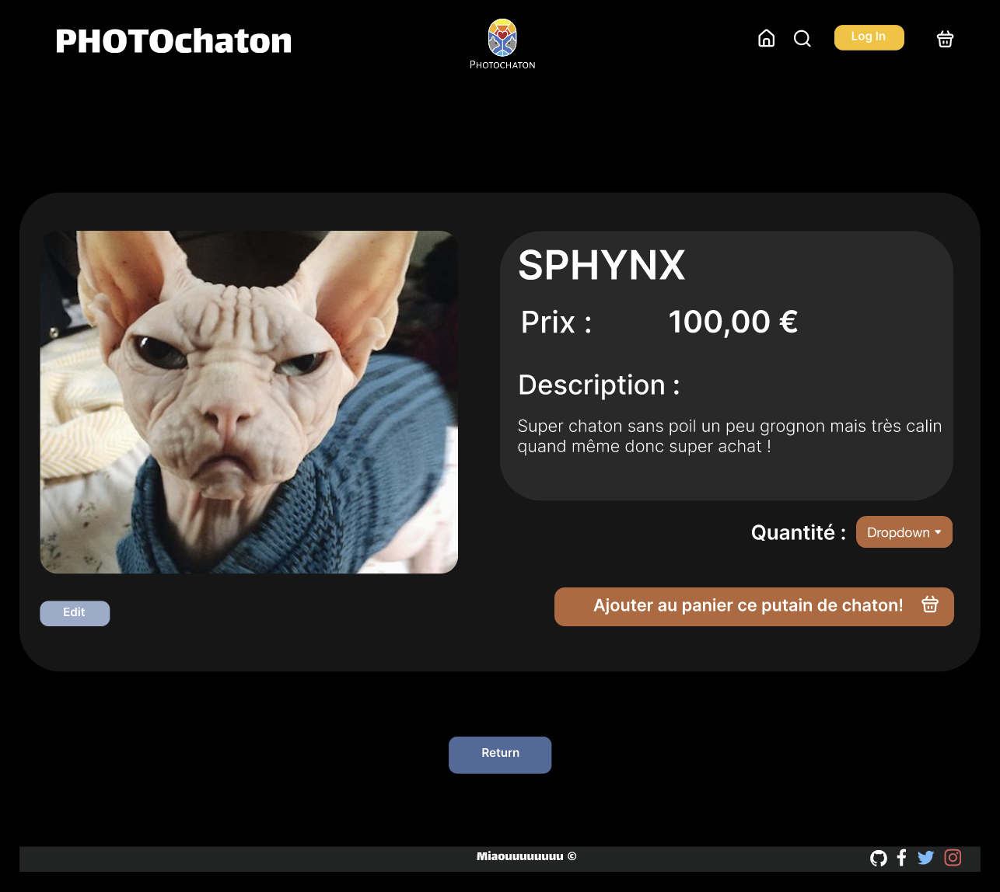

# Maquette Figma de la boutique de chatons

Voici la maquette Figma de notre projet Photochaton, merci à Grégory Magnat et la team Arabicode!

## Aperçu de la maquette 

## Lien pour la consulter 

https://www.figma.com/file/5b3b1PHcctALa14P38zHVg/Boutique-Chaton

# Instructions pour la BDD 

## Lancement 

1. Vous récupérez avec un pull (suivre instructions sur Discord).
2. Vous faîtes un `rails db:create`. 
3. Ensuite un `rails db:migrate` qui implémentera Devise et récupèrera le reste de la base de données.
4. Faîtes un `rails db:seed` pour remplir la base de données. 
5. Une fois que vous allez créer votre branche de travail et switcher, vous devrez peut-être répéter cette opération dans la nouvelle branche.

## Structure de la BDD

L'application utilise une base de données PostgreSQL avec les tables suivantes :

users : Stocke les informations des utilisateurs.
items : Contient les détails des articles.
carts : Enregistre les paniers des utilisateurs.
cart_items : Associe les articles aux paniers.
orders : Stocke les informations des commandes.
order_items : Associe les articles aux commandes.

## Fonctionnement de la BDD 

Utilisateurs : Les utilisateurs sont enregistrés avec une adresse e-mail et un mot de passe.
Articles : Les articles ont un nom, une description, un prix et une URL d'image.
Paniers : Chaque utilisateur a un panier. Les paniers contiennent des articles sous la forme d'éléments de panier (CartItem).
Commandes : Les utilisateurs peuvent passer des commandes, qui sont créées à partir des articles de leur panier. Chaque commande est associée à l'utilisateur et aux articles via OrderItem.

## Création d'une Commande depuis un panier

Pour créer une commande depuis un panier, utilisez la méthode create_from_cart de la classe Order. 

1. Récupérez un utilisateur et son panier :

`user = User.first
cart = user.cart`

2. Créez une commande à partir du panier :

`order = Order.create_from_cart(cart)`